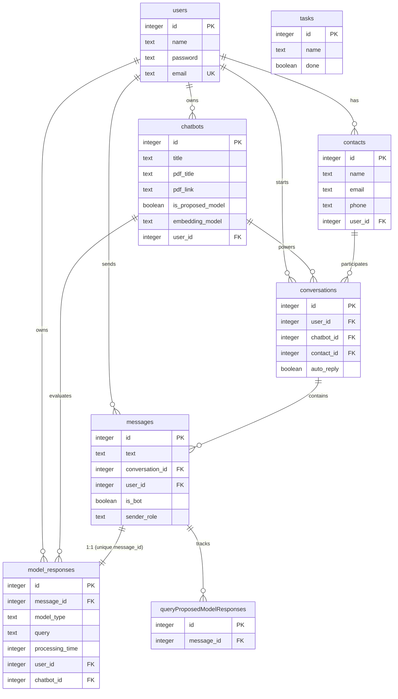

# Word Embedding Chatbot API

> A dual-server **RAG chatbot system** that ingests PDFs, trains word-embedding models, and answers questions using **hybrid semantic search + GPT generation** — with a side-by-side comparison of a **proposed hybrid model** (FastText/Word2Vec + BM25 + MMR reranking + RAGAS evaluation) against a **baseline model**.

[](https://opensource.org/licenses/MIT)
[](https://www.python.org/downloads/)
[](https://nodejs.org/)
[](https://hono.dev/)
[](https://fastapi.tiangolo.com/)
[](https://github.com/KuraoHikari/word-embeding-chatbot-api/issues)

---

## Table of Contents

- [Overview](#overview)
- [Architecture](#architecture)
- [Tech Stack](#tech-stack)
- [Key Features](#key-features)
- [Minimum Requirements](#minimum-requirements)
- [Prerequisites — Third-Party Services](#prerequisites--third-party-services)
- [Environment Variables](#environment-variables)
- [Installation & Setup — Node.js API](#installation--setup--nodejs-api)
- [Installation & Setup — Python ML Server](#installation--setup--python-ml-server)
- [Available Scripts / Commands](#available-scripts--commands)
- [Usage / Commands to Run the Project](#usage--commands-to-run-the-project)
- [API Reference](#api-reference)
- [Project Structure](#project-structure)
- [Database Schema](#database-schema)
- [Usage Workflow](#usage-workflow)
- [Test Results](#test-results)
- [Model Comparison & Conclusion](#model-comparison--conclusion)
- [Security Note](#security-note)
- [Contributing](#contributing)
- [License](#license)
- [Contact](#contact)

---

## Overview

**Word Embedding Chatbot API** is a research-oriented **Retrieval-Augmented Generation (RAG)** platform built to evaluate and compare two document-answering strategies:

1. **Proposed Hybrid Model** — combines **FastText/Word2Vec** dense embeddings with **BM25Okapi** sparse retrieval, **Maximal Marginal Relevance (MMR)** reranking, query-complexity analysis, and **RAGAS** evaluation, finalized with **GPT** answer synthesis.
2. **Baseline Model** — a simpler retrieval + generation pipeline used as the control.

The system is composed of two cooperating servers:

- **Node.js API** (Hono + Drizzle ORM + SQLite/Turso) — port `9999` — the main API gateway with auto-generated OpenAPI docs at `/reference`. It handles authentication, chatbot/conversation management, and proxies PDF training & query requests to the Python server.
- **Python ML Server** (FastAPI + gensim + LangChain) — port `8888` — performs document ingestion, word-embedding model training, hybrid semantic search, and GPT answer generation.

The platform focuses on **Indonesian-language NLP**, using the **Sastrawi** stemmer and Indonesian NLTK stopwords.

---

## Architecture

```mermaid
flowchart LR
    Client[Client / Frontend] --> NodeAPI[Node.js API - Hono - port 9999]
    NodeAPI --> SQLite[(SQLite / Turso)]
    NodeAPI --> Redis[(Upstash Redis - rate limit)]
    NodeAPI -->|train / query> PyAPI[Python ML Server - FastAPI - port 8888]
    PyAPI --> Gensim[Word2Vec / FastText models]
    PyAPI --> BM25[BM25 Okapi]
    PyAPI -->|optional> OpenAI[OpenAI GPT]
    NodeAPI -->|optional embedding> Pinecone[(Pinecone Vector DB)]
    NodeAPI -->|PDF storage| Cloudinary[(Cloudinary)]
```

---

## Tech Stack

| Node.js API                | Python ML Server            |
| -------------------------- | --------------------------- |
| Hono                       | FastAPI                     |
| Drizzle ORM                | gensim (Word2Vec, FastText) |
| SQLite / Turso (libSQL)    | rank-bm25                   |
| Zod / @hono/zod-openapi    | LangChain                   |
| @scalar/hono-api-reference | scikit-learn                |
| argon2 (password hashing)  | NLTK + Sastrawi             |
| hono-pino (logging)        | PyMuPDF / pypdf             |
| hono-rate-limiter          | OpenAI Python SDK           |
| Upstash Redis              | numpy / scipy / pandas      |
| Pinecone client            | uvicorn                     |
| OpenAI SDK                 | python-dotenv               |

---

## Key Features

- **Hybrid Retrieval Pipeline** — fuses dense (FastText/Word2Vec) and sparse (BM25Okapi) search with **MMR reranking** to maximize relevance and diversity of retrieved passages.
- **Proposed vs. Baseline Comparison** — train and query both models side-by-side; responses are persisted for evaluation, with **RAGAS** metrics and query-complexity analysis on the proposed path.
- **Indonesian NLP** — Sastrawi stemming and Indonesian stopword filtering tailored for Bahasa Indonesia documents.
- **PDF Ingestion & Training** — upload PDFs through the Node API; the Python server extracts, chunks, and trains per-chatbot embedding models.
- **GPT Answer Synthesis** — retrieved context is passed to OpenAI GPT to generate natural-language answers (Indonesian).
- **Production-Ready API Gateway** — JWT auth, argon2 hashing, Zod-validated OpenAPI schema, Scalar interactive docs, rate limiting, and structured Pino logging.

---

## Minimum Requirements

- **Node.js** >= 20 (the project is ESM and uses `import.meta`)
- **npm** >= 10
- **Python** 3.11.12 (pinned in `.python-version`)
- **git**
- **OS:** Linux / macOS / Windows (WSL recommended on Windows)

---

## Prerequisites — Third-Party Services

| Service            | Purpose                                                             | Required?  |
| ------------------ | ------------------------------------------------------------------- | ---------- |
| **Turso / libSQL** | SQLite database (local `file:dev.db` for dev, Turso cloud for prod) | Yes        |
| **Upstash Redis**  | Rate limiting                                                       | Yes (prod) |
| **Pinecone**       | Optional vector DB for the `pinecone` embedding mode                | No         |
| **OpenAI API key** | GPT answer generation                                               | Yes        |
| **Cloudinary**     | Optional PDF storage                                                | No         |

---

## Environment Variables

All variables are validated at startup. Node.js variables are checked by the Zod schema in `src/env.ts`; Python variables are read from `.env` via `python-dotenv`. Copy `.env.example` to `.env` and fill in your values.

| Variable                         | Server | Description                                                             | Required   | Default       |
| -------------------------------- | ------ | ----------------------------------------------------------------------- | ---------- | ------------- |
| `NODE_ENV`                       | Node   | Runtime environment                                                     | No         | `development` |
| `PORT`                           | Node   | Node API port                                                           | No         | `9999`        |
| `LOG_LEVEL`                      | Node   | Pino log level (`fatal`/`error`/`warn`/`info`/`debug`/`trace`/`silent`) | Yes        | —             |
| `DATABASE_URL`                   | Node   | SQLite/Turso libSQL URL                                                 | Yes        | —             |
| `DATABASE_AUTH_TOKEN`            | Node   | Turso auth token                                                        | Prod only  | —             |
| `ACCESS_TOKEN_SECRET`            | Node   | JWT secret (use a strong string)                                        | Yes        | —             |
| `ACCESS_TOKEN_EXPIRES_IN`        | Node   | Access-token lifetime (days)                                            | No         | `1`           |
| `ACCESS_TOKEN_SECRET_PUBLIC`     | Node   | Public JWT secret                                                       | Yes        | —             |
| `ACCESS_TOKEN_EXPIRES_IN_PUBLIC` | Node   | Public access-token lifetime (days)                                     | No         | `1`           |
| `UPSTASH_REDIS_REST_URL`         | Node   | Upstash Redis REST URL                                                  | Yes (prod) | —             |
| `UPSTASH_REDIS_REST_TOKEN`       | Node   | Upstash Redis REST token                                                | Yes (prod) | —             |
| `PINECONE_API_KEY`               | Node   | Pinecone API key                                                        | Yes        | —             |
| `API_PASSWORD`                   | Both   | Shared password between Node & Python servers                           | Yes        | —             |
| `PYTHON_SERVER_URL`              | Node   | Base URL of the Python ML server                                        | Yes        | —             |
| `OPEN_AI_API_KEY`                | Node   | OpenAI key (Node side)                                                  | Yes        | —             |
| `ALLOWED_ORIGINS`                | Python | CORS allowed origins                                                    | No         | `*`           |
| `OPENAI_API_KEY`                 | Python | OpenAI key (Python side)                                                | Yes        | —             |
| `PORT_PY`                        | Python | Python ML server port                                                   | No         | `8888`        |

---

## Installation & Setup — Node.js API

```bash
# 1. Clone the repository
git clone https://github.com/KuraoHikari/word-embeding-chatbot-api.git
cd word-embeding-chatbot-api

# 2. Install dependencies
npm install

# 3. Configure environment
cp .env.example .env
#   → edit .env and fill in your real values

# 4. Run database migrations
npx drizzle-kit migrate

# 5. Start the dev server
npm run dev
# → http://localhost:9999
```

---

## Installation & Setup — Python ML Server

> ### 🔒 Strong Recommendation: Use a Python Virtual Environment (`venv`)
>
> Always isolate Python dependencies in a **virtual environment**. This prevents conflicts with system-wide packages, keeps your project reproducible, and makes dependency upgrades safe. The steps below create and activate a `venv` before installing anything.

```bash
# 1. Create a virtual environment (Python 3.11.12 recommended)
python3.11 -m venv venv

# 2. Activate it
#    Linux / macOS:
source venv/bin/activate
#    Windows (PowerShell):
.\venv\Scripts\Activate.ps1
#    Windows (cmd):
.\venv\Scripts\activate.bat

# 3. Upgrade pip
pip install --upgrade pip

# 4. Install Python dependencies
pip install -r requirements.txt

# 5. Download NLTK data (runs automatically on first start, or do it manually)
python -c "import nltk; nltk.download('punkt'); nltk.download('stopwords')"

# 6. Start the ML server
uvicorn api:app --host 0.0.0.0 --port 8888 --reload
# → http://localhost:8888
```

> **Tip:** The `venv/` directory is already in `.gitignore`, so it won't be committed. Remember to `source venv/bin/activate` (or the Windows equivalent) every time you open a new terminal before running Python commands.

---

## Available Scripts / Commands

| Command                                | Server | Description                          |
| -------------------------------------- | ------ | ------------------------------------ |
| `npm run dev`                          | Node   | Start dev server with `tsx watch`    |
| `npm run build`                        | Node   | Compile TypeScript to `dist/`        |
| `npm start`                            | Node   | Run compiled production build        |
| `npm run lint`                         | Node   | Run ESLint                           |
| `npm run lint:fix`                     | Node   | Auto-fix lint issues                 |
| `npm run typecheck`                    | Node   | Type-check without emitting          |
| `npm test`                             | Node   | Run Vitest test suite                |
| `npx drizzle-kit migrate`              | Node   | Apply DB migrations                  |
| `npx drizzle-kit generate`             | Node   | Generate a new migration from schema |
| `uvicorn api:app --port 8888 --reload` | Python | Start ML server in dev               |

---

## Usage / Commands to Run the Project

You need **both servers running** for full functionality. Open two terminals:

**Terminal 1 — Node.js API (port 9999):**

```bash
npm run dev
```

**Terminal 2 — Python ML Server (port 8888):**

```bash
# activate your venv first!
source venv/bin/activate
uvicorn api:app --host 0.0.0.0 --port 8888 --reload
```

Once both are up:

- Node API → <http://localhost:9999>
- Interactive API docs (Scalar) → <http://localhost:9999/reference>
- OpenAPI spec (JSON) → <http://localhost:9999/doc>
- Python ML Swagger docs → <http://localhost:8888/docs>

---

## API Reference

### Node.js API (port 9999)

- **Interactive docs (Scalar):** `http://localhost:9999/reference`
- **OpenAPI spec (JSON):** `http://localhost:9999/doc`

Key endpoints grouped by resource:

| Resource          | Endpoints                                              |
| ----------------- | ------------------------------------------------------ |
| **Auth**          | `POST /auth/register`, `POST /auth/login`              |
| **Chatbots**      | `GET/POST /chatbots`, `GET/PATCH/DELETE /chatbots/:id` |
| **Conversations** | `GET/POST /conversations`, ...                         |
| **Messages**      | `GET/POST /messages`, ...                              |
| **Contacts**      | `GET/POST /contacts`, ...                              |
| **Tasks**         | `GET/POST /tasks`, ...                                 |

### Python ML Server (port 8888)

- **Swagger docs:** `http://localhost:8888/docs`

Key ML endpoints:

| Method   | Path                                               | Description                     |
| -------- | -------------------------------------------------- | ------------------------------- |
| `POST`   | `/train/proposed-model`                            | Train the proposed hybrid model |
| `POST`   | `/train/baseline-model`                            | Train the baseline model        |
| `POST`   | `/query/proposed-model`                            | Query the proposed hybrid model |
| `POST`   | `/query/baseline-model`                            | Query the baseline model        |
| `GET`    | `/models/{userId}/{chatbotId}/proposed`            | List proposed models            |
| `GET`    | `/models/{userId}/{chatbotId}/baseline`            | List baseline models            |
| `DELETE` | `/models/{userId}/{chatbotId}/{pdfTitle}/proposed` | Delete a proposed model         |
| `DELETE` | `/models/{userId}/{chatbotId}/{pdfTitle}/baseline` | Delete a baseline model         |
| `GET`    | `/health/proposed`                                 | Proposed-model health check     |

---

## Project Structure

```
word-embeding-chatbot-api/
├── api.py                    # Python FastAPI ML server
├── requirements.txt          # Python dependencies
├── .python-version           # Python 3.11.12
├── .env.example              # Environment variable template
├── src/
│   ├── app.ts                # Hono app + route registration
│   ├── index.ts              # Server entry point
│   ├── env.ts                # Zod-validated env config
│   ├── db/
│   │   ├── index.ts          # Drizzle client (libSQL)
│   │   ├── schema.ts         # DB schema + Zod schemas
│   │   ├── pinecone.ts       # Pinecone vector integration
│   │   ├── cloudinary.ts     # Cloudinary integration
│   │   ├── redish.ts         # Upstash Redis client
│   │   └── migrations/       # SQL migrations
│   ├── lib/
│   │   ├── configure-open-api.ts
│   │   ├── create-app.ts
│   │   ├── token.ts          # JWT helpers
│   │   ├── hashing.ts        # argon2
│   │   ├── send-training-request-*.ts   # Python server proxy
│   │   ├── send-query-request-*.ts      # Python server proxy
│   │   └── ...
│   ├── middlewares/
│   │   ├── auth.middleware.ts
│   │   ├── body-limit.middleware.ts
│   │   ├── limiter.middleware.ts
│   │   └── pino-logger.ts
│   └── routes/
│       ├── index.route.ts
│       ├── auth/
│       ├── chatbots/
│       ├── contacts/
│       ├── conversations/
│       ├── messages/
│       └── tasks/
├── drizzle.config.ts
├── package.json
└── tsconfig.json
```

---

## Database Schema

The database is defined with [Drizzle ORM](https://orm.drizzle.team) for **SQLite / Turso (libSQL)** in [`src/db/schema.ts`](src/db/schema.ts). All tables share two helper columns:

- `id` — auto-incrementing integer **primary key**
- `created_at` / `updated_at` — timestamp columns (`updated_at` auto-updates on change)

### Entity-Relationship Diagram



### Tables

#### `tasks`

Simple to-do items (demo/utility table).

| Column       | Type      | Constraints               |
| ------------ | --------- | ------------------------- |
| `id`         | integer   | PK, auto-increment        |
| `name`       | text      | NOT NULL                  |
| `done`       | boolean   | NOT NULL, default `false` |
| `created_at` | timestamp | auto                      |
| `updated_at` | timestamp | auto                      |

#### `users`

Application users (admins who manage chatbots).

| Column       | Type      | Constraints                             |
| ------------ | --------- | --------------------------------------- |
| `id`         | integer   | PK, auto-increment                      |
| `name`       | text      | NOT NULL                                |
| `password`   | text      | NOT NULL (argon2 hash)                  |
| `email`      | text      | NOT NULL, **unique** (case-insensitive) |
| `created_at` | timestamp | auto                                    |
| `updated_at` | timestamp | auto                                    |

#### `chatbots`

A chatbot configuration bound to a PDF knowledge source.

| Column               | Type      | Constraints / Default                   |
| -------------------- | --------- | --------------------------------------- |
| `id`                 | integer   | PK, auto-increment                      |
| `title`              | text      | NOT NULL                                |
| `description`        | text      | nullable                                |
| `is_public`          | boolean   | NOT NULL, default `false`               |
| `welcome_message`    | text      | NOT NULL                                |
| `suggestion_message` | text      | NOT NULL                                |
| `system_prompt`      | text      | NOT NULL, default `defaultSystemPrompt` |
| `ai_model`           | text      | NOT NULL, default `gpt-3.5-turbo`       |
| `is_proposed_model`  | boolean   | NOT NULL, default `true`                |
| `embedding_model`    | text      | NOT NULL, default `fasttext`            |
| `temperature`        | integer   | NOT NULL, default `30`                  |
| `max_tokens`         | integer   | NOT NULL, default `500`                 |
| `pdf_title`          | text      | NOT NULL                                |
| `pdf_link`           | text      | NOT NULL                                |
| `user_id`            | integer   | FK → `users.id`, NOT NULL               |
| `created_at`         | timestamp | auto                                    |
| `updated_at`         | timestamp | auto                                    |

#### `contacts`

End-users/visitors who chat with a chatbot.

| Column       | Type      | Constraints               |
| ------------ | --------- | ------------------------- |
| `id`         | integer   | PK, auto-increment        |
| `name`       | text      | NOT NULL                  |
| `email`      | text      | NOT NULL                  |
| `phone`      | text      | nullable                  |
| `user_id`    | integer   | FK → `users.id`, NOT NULL |
| `created_at` | timestamp | auto                      |
| `updated_at` | timestamp | auto                      |

#### `conversations`

A chat session between a contact and a chatbot.

| Column       | Type      | Constraints                  |
| ------------ | --------- | ---------------------------- |
| `id`         | integer   | PK, auto-increment           |
| `user_id`    | integer   | FK → `users.id`, NOT NULL    |
| `chatbot_id` | integer   | FK → `chatbots.id`, NOT NULL |
| `contact_id` | integer   | FK → `contacts.id`, NOT NULL |
| `auto_reply` | boolean   | NOT NULL, default `true`     |
| `created_at` | timestamp | auto                         |
| `updated_at` | timestamp | auto                         |

#### `messages`

Individual messages within a conversation.

| Column            | Type      | Constraints                                           |
| ----------------- | --------- | ----------------------------------------------------- |
| `id`              | integer   | PK, auto-increment                                    |
| `text`            | text      | NOT NULL                                              |
| `conversation_id` | integer   | FK → `conversations.id`, NOT NULL                     |
| `user_id`         | integer   | FK → `users.id`, NOT NULL                             |
| `is_bot`          | boolean   | NOT NULL, default `false`                             |
| `sender_role`     | text      | enum `admin` \| `bot` \| `contact`, default `contact` |
| `created_at`      | timestamp | auto                                                  |
| `updated_at`      | timestamp | auto                                                  |

#### `model_responses`

Stores the full retrieval + generation + evaluation output for both the **proposed** and **baseline** models. Has a **1:1** relationship with `messages` via a unique `message_id`.

| Column                | Type      | Constraints / Notes                                           |
| --------------------- | --------- | ------------------------------------------------------------- |
| `id`                  | integer   | PK, auto-increment                                            |
| `message_id`          | integer   | FK → `messages.id`, NOT NULL, **unique** (enforces 1:1)       |
| `model_type`          | text      | enum `proposed` \| `baseline`, NOT NULL                       |
| `query`               | text      | NOT NULL                                                      |
| `processing_time`     | integer   | NOT NULL (ms)                                                 |
| `results`             | json      | NOT NULL — retrieved passages + scores                        |
| `metadata`            | json      | NOT NULL — model type, features used, hyperparameters         |
| `complexity_analysis` | json      | nullable — **proposed only** (type, score, weights)           |
| `search_pipeline`     | json      | nullable — **proposed only** (hybrid/MMR/cross-encoder stats) |
| `model_approach`      | text      | nullable — **baseline only** (e.g. `baseline`)                |
| `pipeline_steps`      | json      | nullable — **baseline only** (ordered step list)              |
| `gpt_generation`      | json      | nullable — GPT answer, tokens used                            |
| `ragas_evaluation`    | json      | nullable — RAGAS metrics + score breakdown                    |
| `message`             | text      | nullable                                                      |
| `user_id`             | integer   | FK → `users.id`, NOT NULL                                     |
| `chatbot_id`          | integer   | FK → `chatbots.id`, NOT NULL                                  |
| `created_at`          | timestamp | auto                                                          |
| `updated_at`          | timestamp | auto                                                          |

#### `queryProposedModelResponses`

Lightweight tracking table linking messages to proposed-model query records.

| Column       | Type      | Constraints                  |
| ------------ | --------- | ---------------------------- |
| `id`         | integer   | PK, auto-increment           |
| `message_id` | integer   | FK → `messages.id`, NOT NULL |
| `created_at` | timestamp | auto                         |
| `updated_at` | timestamp | auto                         |

### Relationships Summary

| Parent          | Child             | Cardinality | Via                   |
| --------------- | ----------------- | ----------- | --------------------- |
| `users`         | `chatbots`        | 1 — N       | `user_id`             |
| `users`         | `contacts`        | 1 — N       | `user_id`             |
| `users`         | `conversations`   | 1 — N       | `user_id`             |
| `users`         | `messages`        | 1 — N       | `user_id`             |
| `users`         | `model_responses` | 1 — N       | `user_id`             |
| `chatbots`      | `conversations`   | 1 — N       | `chatbot_id`          |
| `chatbots`      | `model_responses` | 1 — N       | `chatbot_id`          |
| `contacts`      | `conversations`   | 1 — N       | `contact_id`          |
| `conversations` | `messages`        | 1 — N       | `conversation_id`     |
| `messages`      | `model_responses` | 1 — 1       | `message_id` (unique) |

---

## Usage Workflow

1. **Register a user** → `POST /auth/register`
2. **Login** → `POST /auth/login` (returns a JWT)
3. **Create a chatbot with a PDF** → `POST /chatbots` (triggers training on the Python server)
4. **Create a conversation** → `POST /conversations`
5. **Send a message / query** → `POST /messages` (Node forwards to Python `/query/proposed-model` or `/query/baseline-model`)
6. **Compare** proposed vs. baseline model responses (stored in the `modelResponses` table)

---

## Test Results

Both models were evaluated on an identical set of **20 Indonesian-language Q&A samples** drawn from the _"Panduan Penggunaan Booking Engine Omni Hottilier"_ PDF. Each query flows through retrieval → GPT generation → **RAGAS** evaluation, and the full output is persisted in the [`model_responses`](#model_responses) table.

Raw result artifacts: [`messages-baseline-results.json`](tests/e2e/output/messages-baseline-results.json) · [`messages-proposed-results.json`](tests/e2e/output/messages-proposed-results.json).

### RAGAS Score Composition

The `overall_score` is a weighted blend:

| Component           | Weight |
| ------------------- | ------ |
| `faithfulness`      | 0.35   |
| `answer_relevance`  | 0.20   |
| `context_relevance` | 0.15   |
| `context_precision` | 0.15   |
| `context_recall`    | 0.15   |

### Aggregated RAGAS Metrics (n = 20)

| Metric            | Baseline (avg) | Proposed (avg) | Δ (Proposed − Baseline) |
| ----------------- | -------------- | -------------- | ----------------------- |
| **Overall Score** | **0.785**      | **0.857**      | **+0.072**              |
| Faithfulness      | 0.739          | 0.848          | +0.109                  |
| Answer Relevance  | 0.899          | 0.892          | −0.007                  |
| Context Relevance | 0.667          | 0.780          | +0.113                  |
| Context Precision | 0.950          | 0.975          | +0.025                  |
| Context Recall    | 0.758          | 0.881          | +0.123                  |

### Overall-Score Distribution

| Model    | Min   | Max   | Range |
| -------- | ----- | ----- | ----- |
| Baseline | 0.645 | 0.950 | 0.305 |
| Proposed | 0.692 | 0.950 | 0.258 |

> The proposed model lifts the **floor** of performance (min 0.645 → 0.692) and narrows the spread, indicating more **consistent** retrieval quality across queries — it handles low-scoring outlier queries better than the baseline.

### Sample Query

|                      |                                                                                                                                    |
| -------------------- | ---------------------------------------------------------------------------------------------------------------------------------- |
| **Query**            | _"Apa itu Dashboard Booking Engine?"_                                                                                              |
| **Baseline answer**  | Lists dashboard sub-features (channel type, conversion overview, end date period, visit overtime, visit in realtime, theme setup). |
| **Proposed answer**  | Describes the dashboard's purpose + adds **Visitor Map** and **GEO promotion** context retrieved via hybrid search.                |
| **Baseline overall** | `0.830`                                                                                                                            |
| **Proposed overall** | `0.769` (lower faithfulness on this single item, but richer, more complete context)                                                |

> Single-query scores can favour either model; the aggregate tables above reflect the overall trend across all 20 samples.

---

## Model Comparison & Conclusion

### Side-by-Side Comparison

| Aspect                        | Baseline Model                                              | Proposed Hybrid Model                                                               |
| ----------------------------- | ----------------------------------------------------------- | ----------------------------------------------------------------------------------- |
| **Model type**                | `fasttext_baseline`                                         | `fasttext_hybrid`                                                                   |
| **Retrieval strategy**        | Dense only (FastText cosine similarity)                     | Dense (FastText) **+** sparse (BM25Okapi) **+** context scoring                     |
| **Reranking**                 | ❌ None                                                     | ✅ MMR (λ = 0.7) **+** cross-encoder (α = 0.6)                                      |
| **Query-complexity analysis** | ❌ No                                                       | ✅ Yes — adaptive weighting (FastText 0.5 / BM25 0.3 / context 0.2)                 |
| **Cross-encoder reranking**   | ❌ No                                                       | ✅ Yes                                                                              |
| **Semantic search**           | ✅ Yes                                                      | ✅ Yes                                                                              |
| **Keyword search**            | ❌ No                                                       | ✅ Yes                                                                              |
| **Context scoring**           | ❌ No                                                       | ✅ Yes                                                                              |
| **Pipeline steps**            | 6 (Preprocessing → FastText → Cosine → Top-k → GPT → RAGAS) | 7+ (Preprocessing → Hybrid Search → MMR → Cross-encoder → Complexity → GPT → RAGAS) |
| **Avg processing time**       | ~2.2 s                                                      | ~4.5 s                                                                              |
| **Avg overall RAGAS**         | **0.785**                                                   | **0.857**                                                                           |
| **Avg faithfulness**          | 0.739                                                       | 0.848                                                                               |
| **FastText hyperparameters**  | vec=100, win=5, min_count=1, epochs=20, sg=1                | vec=100, win=5, min_count=1, epochs=20, sg=1                                        |
| **GPT model**                 | gpt-3.5-turbo                                               | gpt-3.5-turbo                                                                       |

### Key Differences

- **Baseline** relies on a single dense-similarity signal (FastText cosine similarity) and returns the top-k passages directly to GPT. It is fast but can miss keyword-critical or contextually nuanced passages.
- **Proposed** fuses **three retrieval signals** (FastText + BM25Okapi + context scoring), then applies **two reranking stages** (MMR for diversity, cross-encoder for relevance) and adapts signal weights based on a **query-complexity classifier**. This produces a more relevant, diverse, and faithful context window for GPT.

### Conclusion

Across the 20-query evaluation set, the **proposed hybrid model outperforms the baseline** on the weighted RAGAS overall score (**0.857 vs 0.785**, a **+9.2% relative improvement**) and on faithfulness (**+14.7% relative**). The proposed model's hybrid retrieval and multi-stage reranking yield higher `context_recall` (+0.123) and `context_relevance` (+0.113), meaning it surfaces more of the ground-truth supporting passages and ranks them more pertinently.

Crucially, the **proposed model handles outliers better** — its minimum overall score (0.692) is higher than the baseline's (0.645), and its score spread is tighter (0.258 vs 0.305), indicating more **stable** performance on difficult or ambiguous queries where pure dense retrieval fails.

The trade-off is **latency and cost**: the proposed pipeline is roughly **2× slower** (~4.5 s vs ~2.2 s) and consumes more GPT tokens due to larger, richer context windows. For production chatbot workloads where answer faithfulness and robustness to varied phrasings matter more than sub-second latency, the **proposed hybrid model is the recommended deployment choice**.

---

## Security Note

- ⚠️ **Never commit real `.env` files.** `.env` is listed in `.gitignore`.
- Use `.env.example` as a template — it contains **placeholder values only** (no real secrets).
- Rotate any keys that have ever been exposed in version control.
- Set strong `ACCESS_TOKEN_SECRET` / `ACCESS_TOKEN_SECRET_PUBLIC` values (use long, random strings).
- Keep `API_PASSWORD` consistent between the Node and Python servers.

---

## Contributing

Contributions are welcome! Please follow these steps:

1. **Fork** the repository.
2. Create a feature branch:
   ```bash
   git checkout -b feature/your-feature-name
   ```
3. Commit your changes with clear, descriptive messages.
4. Ensure code passes linting and type-checking:
   ```bash
   npm run lint
   npm run typecheck
   ```
5. Push your branch and open a **Pull Request** describing your changes.

Please open an [issue](https://github.com/KuraoHikari/word-embeding-chatbot-api/issues) first to discuss major changes before submitting a PR.

---

## License

This project is licensed under the **MIT License** — © KuraoHikari.

See the [LICENSE](LICENSE) file for details.

---

## Contact

- **Author:** KuraoHikari
- **GitHub:** [@KuraoHikari](https://github.com/KuraoHikari)
- **Repository:** [word-embeding-chatbot-api](https://github.com/KuraoHikari/word-embeding-chatbot-api)
- **Issues:** [Report a bug / request a feature](https://github.com/KuraoHikari/word-embeding-chatbot-api/issues)
